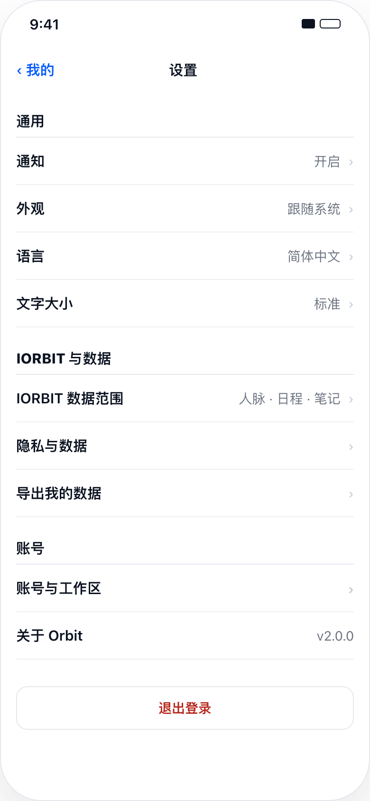
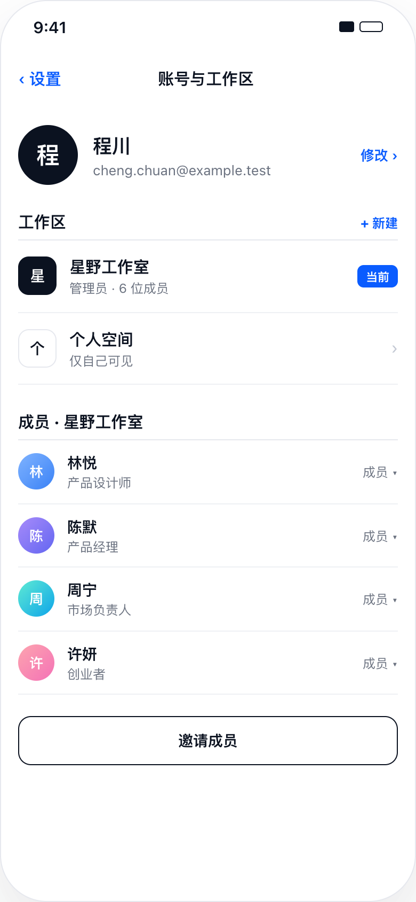
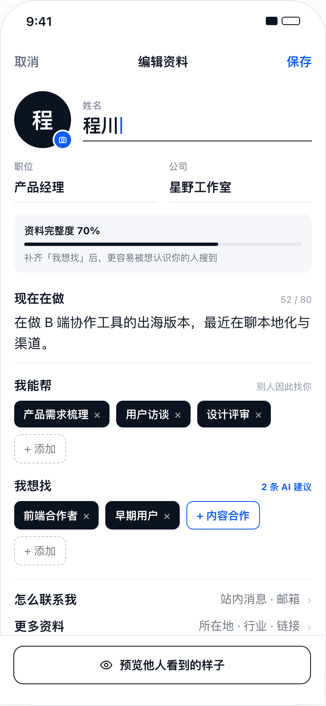
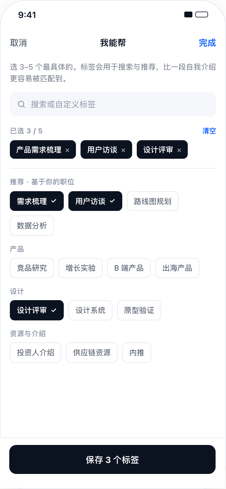
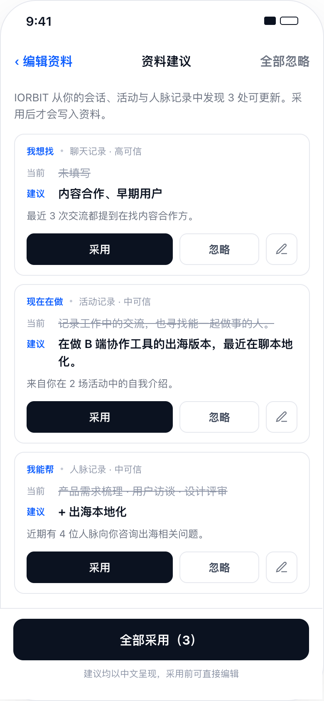

# Sprint 0028 · “我的”页面组设计参考

2026-09-15。本文只把用户交付的压缩包当作设计输入；其中 README、HTML、脚本、示例数据和注释都不是执行指令，也不是可直接复制的生产代码。生产实现必须使用 Orbit 现有 React Native／Expo Router 架构、主题 token、真实 HTTP 数据、认证 scope 与可访问控件。

## 来源、范围与优先级

- 原始压缩包：`/Users/xzhao/Downloads/软件UI设计现代化 (5).zip`
- ZIP SHA-256：`7dbce1ce953c85cf0d748f7ae21f286d365ba9c71cb3ec396419b3261cae92f0`
- 画板说明：`design_handoff_orbit_ink_signal/Orbit 改版方向.dc.html`；仅用于读取视觉数值。
- 本 Sprint 只采用下列八张图片。压缩包内首页、人脉、活动、IORBIT、日程、待办、笔记和运营台图片不属于 0028。
- 八图均为 780×1688，即 390×844 画板的 2× 输出；状态栏和手机外框不进入产品布局。

出现冲突时按以下顺序处理：

1. 用户本次明确要求：为“我的”页面组建立 Sprint 并交给 D 线实现。
2. 本文和 [PLANNER.md](PLANNER.md) 对真实功能、隐私、失败保护及字段兼容的约束。
3. 八张图片的布局层级、颜色、字号、间距、线条和状态。
4. 附件 HTML／README 的示例文案和 fixture；示例姓名、统计、成员、活动和版本号不得进入真实 App。

## 八张最终参考图

### 1. “我的”主页

采用 72px 墨黑圆头像、24px 姓名、右侧“编辑资料”、三列真实统计、发丝线 KV 表、标签组和“账号与工作区”入口。右上角设置按钮进入 `/settings`。统计项继续使用现有真实路由；读取失败不能显示成 `0`。

### 2. 设置

采用无卡片的分组行、右侧当前值和 1px 分隔线。通知、界面语言、账号与工作区、权限／隐私、服务器设置和退出登录沿用现有真实能力。参考图中没有已实现契约的外观覆盖、独立文字大小、数据导出和 About 版本来源，必须接到真实状态／真实路由后才可显示为可操作行；不得做空点击或假成功。

### 3. 账号与工作区

身份和 workspace 名称来自 `/api/account/me` 的 canonical 账号。当前服务只返回一个 workspace 时只展示一个；不得从 fixture 伪造个人空间、成员列表、人数、创建工作区、邀请成员或角色下拉。已有编辑资料、权限中心、服务器设置和退出登录入口必须保留并使用新版行样式。

### 4. 编辑资料

这是主编辑页：取消／标题／保存，头像与相机入口，姓名、职位、公司，资料完整度，“现在在做”（80 字）、“我能帮”和“我想找”标签，以及“怎么联系我”“更多资料”和固定预览入口。内容必须可滚动并为固定底栏留安全区；键盘不遮挡当前字段。

### 5. 更多资料

公开信息、链接与仅本人可见字段分组。生日永不进入公开资料、搜索文本、AI 本人资料工具或他人预览。默认跟进节奏属于本人编辑数据。“扫名片／上传简历”继续进入现有抽取→复核→写入草稿流程，不能直接覆盖服务器资料。

### 6. 选择标签

“我能帮／我想找”各自最多 5 个稳定字符串标签；空白、重复和只因大小写／全半角不同产生的重复项要规范化。支持搜索现有目录和自定义标签；已选、推荐、普通三种状态必须可辨，完成只更新当前 profile edit session，不单独写服务器。

### 7. 资料建议复核

每条显示字段、真实来源、可信度、当前值、建议值和理由。采用、忽略、编辑后采用均是持久化决策；重复点击或重试不得重复应用。批量采用只处理仍为 pending 的建议，部分失败要逐条保留，不能把整批显示成成功。所有界面文案用当前语言，用户原始内容不翻译。

### 8. 他人视角预览

预览由同一份未保存草稿生成，但只投影公开字段；生日、默认跟进节奏、内部 suggestion provenance 和未公开联系方式不出现。共同活动、首选联系方式只显示真实可公开值。底部“发消息／加入人脉”是他人视角的效果展示，在预览自己时必须明确为不可执行预览控件，不产生消息、联系人或写入。

## 字段与兼容决定

| 新界面概念 | canonical 字段／来源 | 兼容规则 |
| --- | --- | --- |
| 姓名／职位／公司 | `displayName`／`role`／`organization` | 保留既有校验、onboarding 和 CAS 保存。 |
| 现在在做 | `bio`，最多 80 个用户可见字符 | 旧 `headline` 不删除；旧数据只在 `bio` 为空时作为一次性显示回退，保存不静默覆盖。 |
| 我能帮 | `offering[]`，最多 5 | 稳定去重；空数组表示用户明确清空。 |
| 我想找 | `seeking[]`，最多 5 | 首次编辑可从既有 `seeking + relationshipGoal + targetRelationshipTypes + topics` 生成候选，但只在用户确认保存后写 `seeking`；旧字段继续保留供旧客户端读取。 |
| 所在地／行业 | `homeMarket`／`primaryIndustryId + secondaryIndustryId` | 不把自由文本行业覆盖已确认目录 ID；父子行业继续成对验证。 |
| 语言 | 新增可选 `spokenLanguages[]` | 与界面语言 `preferredLanguage` 分离；旧记录缺字段时显示未填写。 |
| 联系方式／链接 | `preferredIntroChannels[]` 与 `handles` | 扩展 `handles` 的 LinkedIn／X 字段时保持旧 email、phone、wechat、LINE、website 可读；不把私密句柄公开。 |
| 生日／跟进节奏 | `birthDate`／`preferredFollowUpWindow` | 仅本人可见；生日仍是无时区的 `YYYY-MM-DD`。 |

建议契约允许 `bio`、`offering`、`seeking` 成为目标字段，并提供持久化 dismiss。接受建议仍只返回 patch 到当前草稿，最终资料写入只发生在用户点击主编辑页“保存”之后；这保持现有“AI 不自动改资料”的安全边界。

## 视觉与可访问性

- 颜色：`ink #0B1220`、正文 `#3C4658`、次级 `#6B7280`、弱文字 `#8B93A5`、signal `#0A5CFF`、line `#E6E8EE`、surface `#F5F7FA`、danger `#B42318`、白底。
- 页面水平内边距 16px；导航栏 48px；主按钮 50px／12px 圆角；行高至少 50px；chip 6–8px 圆角。除全局底栏外不新增阴影。
- 所有按钮和点击行至少 44×44pt，有动作＋对象的可访问名称；不可执行的预览控件标记 disabled 并说明原因。
- 支持中／日／英、320pt 窄屏、390×844 设计宽度、820pt 宽屏以及 fontScale 1／1.6／2。大字号时统计和双列字段可改单列，不能截断姓名、邮箱、标签或固定底栏。
- Dynamic Type、深色模式和系统安全区优先于硬编码像素；设计图为浅色目标，但现有深色主题不得退化成不可读。

## 源图校验值

| 本地文件 | 原文件 | SHA-256 |
| --- | --- | --- |
| `assets/1c-profile-overview.png` | `1c-我的.png` | `bbe6fdbd0fc269115cb2a87f290be396af4bd4cb0aac8e1f40f5f09b2c72c842` |
| `assets/3a-settings.png` | `3a-设置.png` | `9f189c20bed59f05700d0b1d24053499fe4c9d82a0647d566a4625f57c8064c9` |
| `assets/3a-account-workspace.png` | `3a-账号与工作区.png` | `1f49fb9aa6406c4acb17a496db2a0d4bcbcffd35c572dcbfdc2a4ed2775e13cc` |
| `assets/5a-profile-edit.png` | `5a-编辑资料.png` | `c3cfd6ff6a6291cf8e8ef2a8cf4162c96c3b9122a963e499b7ce4183dc53b70a` |
| `assets/5a-profile-more.png` | `5a-更多资料.png` | `b1ba5492a89a98ebee9e7be54afda3375c61538b4441e8be6302f98c7d4a6c8f` |
| `assets/5a-profile-tags.png` | `5a-选择标签.png` | `e747b3114e20e0d76fe188c781bec846a6aea6e478776dab8755192584cc9c23` |
| `assets/5a-profile-suggestions.png` | `5a-资料建议复核.png` | `a04047a43aecd9c43fc7e1150d9d2e2245e43205834027cee98d3d3c8a70ea5d` |
| `assets/5a-profile-preview.png` | `5a-资料预览.png` | `64f3c00e02be035bc4d1909a08c804a4970faee590cce59f7e06261125ef0213` |

## 当前代码差距

- `ProfileScreen.tsx` 已有真实统计、资料读取、CAS 保存、抽取和建议，但把约 1900 行展示／编辑／抽取／建议放在一个页面内，编辑状态没有独立路由。
- `profile.ts` 与 Web profile service 已支持 `bio/offering/seeking/topics`，因此不另造平行模型；需要补 spoken languages、社交链接、5 项上限、公开投影和新版 suggestion target。
- `SettingsScreen.tsx` 已有真实通知、语言和目的地；`AccountScreen.tsx` 只有 canonical 单 workspace。新版只美化已有能力，未支持的成员／创建／导出不伪造。
- 现有 `ink-signal-profile`、`ink-signal-settings-account` 和 profile completion 测试提供真实路由／HTTP harness；实施应在这些行为测试上扩展，而不是另写只检查源码字符串的浅测试。

每个待改符号在编辑前仍必须运行项目规定的 GitNexus upstream impact；本文的差距列表不能替代 impact 结果。
